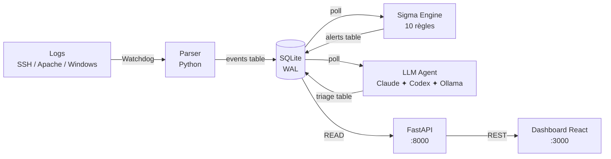

# 🛡️ SOC-AI

> **Security Operations Center** propulsé par LLM — Triage automatique des alertes pour PME et ETI

[](https://github.com/Crypt0nik/soc-ai/actions)
[](LICENSE)
[](https://python.org)
[](docker-compose.yml)

---

## Proposition de valeur

| | |
|---|---|
| 🟢 **ACCESSIBILITÉ** | Déployable en 5 minutes via `docker compose up`, sans expertise SOC |
| 🧠 **INTELLIGENCE** | Triage LLM : severity MITRE ATT&CK, recommandation en français |
| 💰 **ÉCONOMIE** | Version Community 100% gratuite, open source MIT |

> ⚠️ **Avertissement RGPD** : Ne pas envoyer de données personnelles (PII) à un LLM cloud.
> Activez `ANONYMIZE_PII=true` (défaut) ou utilisez **Ollama en local** pour les logs sensibles.

---

## Quick Start

```bash
git clone https://github.com/your-org/soc-ai.git
cd soc-ai
cp .env.example .env        # Éditez si besoin (clé Anthropic ou Ollama)
docker compose up
```

Ouvrez [http://localhost:3000](http://localhost:3000) — le dashboard est prêt.

Pour tester avec des faux logs :
```bash
bash scripts/replay_bruteforce.sh
```

---

## Architecture



---

## Screenshot


<!-- TODO: ajouter GIF démo triage LLM -->
*GIF démo du triage LLM à venir.*

---

## Fonctionnalités (v1.0 — Community)

- ✅ Ingestion temps réel : SSH `auth.log`, Apache/Nginx, Windows Event Log XML, JSON générique
- ✅ 10 règles Sigma (SSH-001→003, WEB-001→003, WIN-001→003, NET-001)
- ✅ Triage LLM : `severity`, `attack_type` MITRE ATT&CK, `confidence`, `summary` FR, `recommendation` FR
- ✅ Backends LLM : **Claude API**, **OpenAI Codex/Responses API**, **Ollama** local offline
- ✅ Anonymisation PII réversible avant envoi LLM cloud
- ✅ Dashboard React : liste paginée, filtres, vue détail, codes couleur criticité
- ✅ API REST : `/alerts`, `/stats`, `/export`
- ✅ Déploiement 1 commande : `docker compose up`
- ✅ Rétention configurable (défaut 90 jours)

---

## Positionnement

| | SOC-AI ⭐ | Splunk | Sentinel | Elastic SIEM | Wazuh |
|---|---|---|---|---|---|
| **Prix** | Gratuit | 50k–500k€/an | Variable Azure | Gratuit/10k€+ | Gratuit |
| **Déploiement** | < 5 min | Semaines | Semaines | Jours | Jours |
| **Triage LLM** | ✅ Natif | ❌ | ❌ | ❌ | ❌ |
| **MITRE ATT&CK** | ✅ | ✅ | ✅ | ✅ | ✅ |
| **Offline / souverain** | ✅ Ollama | ❌ | ❌ | Partiel | ✅ |
| **Cible** | PME/ETI | Grands comptes | Entreprises MS | Équipes tech | PME techniques |

---

## Codes couleur criticité

| Severity | Couleur | Action |
|----------|---------|--------|
| `CRITICAL` | 🔴 `#FF0000` | Intervention < 15 min |
| `HIGH` | 🟠 `#FF6600` | Traitement dans l'heure |
| `MEDIUM` | 🟡 `#FFB300` | Traitement dans la journée |
| `LOW` | 🔵 `#0066CC` | Revue hebdomadaire |
| `INFO` | ⚫ `#666666` | Archivage |

---

## Roadmap

| Version | Périmètre | Date estimée |
|---------|-----------|-------------|
| **v1.5** | Alertes webhook Slack/Teams, score de risque cumulatif, 50 règles Sigma | Q3 2026 |
| **v2.0** | NIS2 Compliance Dashboard, connecteur Elastic/OpenSearch, multi-tenant MSSP | Q1 2027 |
| **v3.0** | Agent réponse auto (blocage IP), heatmap MITRE ATT&CK, fine-tuning LLM | 2028 |

---

## Configuration

Toutes les options sont dans `.env` (copiez `.env.example`) :

| Variable | Défaut | Description |
|----------|--------|-------------|
| `LLM_BACKEND` | `ollama` | `claude`, `codex` ou `ollama` |
| `ANTHROPIC_API_KEY` | — | Clé API Anthropic (si `LLM_BACKEND=claude`) |
| `OPENAI_API_KEY` | — | Clé API OpenAI (si `LLM_BACKEND=codex`) |
| `CODEX_MODEL` | `gpt-5.4-mini` | Modèle OpenAI utilisé par le backend Codex |
| `ANONYMIZE_PII` | `true` | Anonymise IP/user/email avant LLM cloud |
| `RETENTION_DAYS` | `90` | Rétention des données en jours |
| `OLLAMA_MODEL` | `llama3.1` | Modèle Ollama |

---

## Contributing

Voir [CONTRIBUTING.md](CONTRIBUTING.md). Issues et PRs bienvenues !

## Sécurité

Voir [SECURITY.md](SECURITY.md) pour le traitement des PII et les bonnes pratiques de déploiement.

## Licence

[MIT](LICENSE) — Copyright © 2026 SOC-AI contributors
